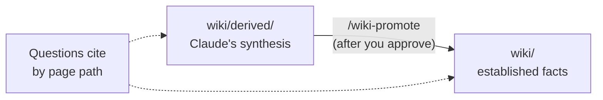
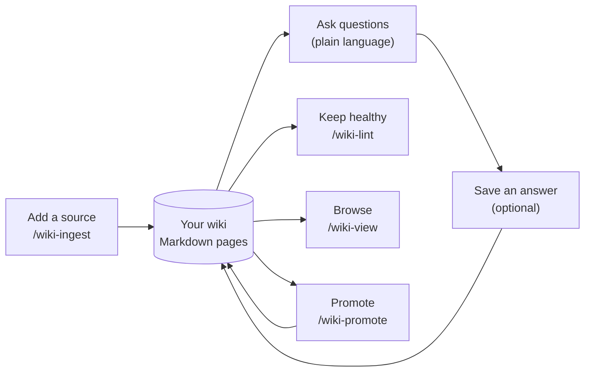
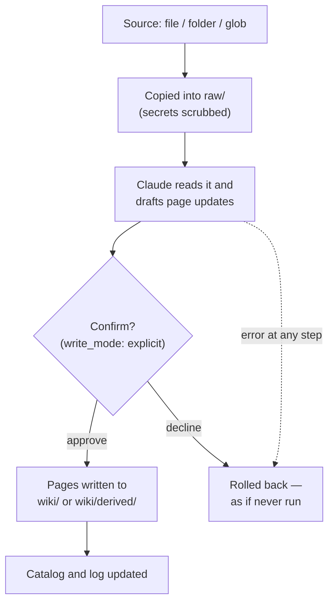

# llm-wiki — User Guide

A friendly, task-oriented walkthrough for **using** llm-wiki day to day. It assumes
no knowledge of the plugin's internals. If you want the design rationale, code
layout, or the full option reference, see the [README](README.md); this guide
sticks to *what you do* and *what happens*.

[日本語版はこちら](USER_GUIDE_ja.md)

---

## 1. What llm-wiki is, in one minute

llm-wiki turns your scattered sources — documents, notes, command outputs, chat/session
logs — into a small **wiki of Markdown pages** that Claude writes and keeps up to date,
and that you can then **ask questions against**.

Two ideas are worth knowing up front:

- **A wiki is just a folder.** It holds your source material, the pages Claude wrote,
  a catalog, and a log. There is no database and no server. You can open every file
  yourself, and you version it (or not) however you like — llm-wiki never touches git.
- **Trust is decided by *where a page lives*.** Pages under `wiki/` are treated as
  established facts you can cite. Pages under `wiki/derived/` are Claude's own
  synthesis, kept separate until you explicitly *promote* them. You always know which
  is which by the folder.



You interact with it entirely through Claude Code — a few slash commands plus plain
natural-language questions.

---

## 2. Before you start

- **Claude Code** with the plugin installed:

  ```
  /plugin marketplace add gigamori/ai-agent-toolkit
  /plugin install llm-wiki@ai-agent-toolkit
  ```

- **[uv](https://docs.astral.sh/uv/)** on your PATH. The plugin runs its engine with
  `uv run`; you don't install anything else. The everyday read/query path has **no
  extra dependencies**.

Once the plugin is enabled it activates on its own the moment you're working inside a
wiki — there's no separate "turn it on" step.

---

## 3. Create your wiki

Run:

```
/wiki-init
```

It asks where to put the wiki and creates it as a plain folder. If you'd rather skip
the menu, point it straight at a location:

```
/wiki-init --root ./path/to/wiki
```

That's it — you now have a wiki folder containing an empty catalog, a log, and the
`raw/` and `wiki/` subfolders that will fill up as you use it.

---

## 4. The everyday loop

Work from inside your wiki folder (or pass `--root <path>` to any command). Each turn,
Claude quietly shows a line like `active wiki: <path>` so you always know which wiki
you're in. Outside a wiki, the plugin stays completely out of your way.



### Add a source — `/wiki-ingest`

Point it at a file, a folder, or a quoted glob:

```
/wiki-ingest ./docs/rfc-routing.md          # one document
/wiki-ingest ./logs/session.jsonl           # a Claude Code session log
/wiki-ingest "./docs/**/*.md"               # many files at once (quote the glob!)
/wiki-ingest ./docs/                         # a whole folder (text files only)
```

Optionally attach a link so answers can cite the original:

```
/wiki-ingest ./docs/rfc.md external=https://example.com/rfc
```

What happens: the source is copied into `raw/` (secrets are scrubbed first), then
Claude reads it and writes or updates the relevant pages. **Before any page is
written you see a confirmation** and a one-line note of the settings in effect — nothing
is saved until you approve. If anything goes wrong mid-way, that source's changes are
rolled back cleanly, as if you'd never run it. When you ingest many files at once, each
file is handled independently and you get a `succeeded / failed / skipped` summary at
the end.



### Ingest a whole project's sessions — `/wiki-ingest-project`

`/wiki-ingest` takes one source at a time. When you want to pull in **every Claude Code
session of the current project** at once, use its project-wide sibling:

```
/wiki-ingest-project                 # every session of the current project
/wiki-ingest-project --pj my-proj    # only sessions tagged to a named project
```

It finds the session set, ingests each session **one at a time** (each in its own
transaction, so one bad session never sinks the others), and prints a
`succeeded / failed / skipped` summary plus how many sessions it resolved and how many
turns it skipped.

Two things worth knowing:

- **It's incremental and safe to re-run.** Each turn is remembered the first time it's
  filed (in a small ledger), so running it again as the project grows only files the
  *new* turns — the same turn is never filed twice, even across `/wiki-ingest` and
  `/wiki-ingest-project`. The summary's **ledger-skipped turns** count tells you how much
  was already there, so a re-run is never a silent no-op.
- **`--pj` covers only what taskflow tagged.** With `--pj <name>`, the scope is the
  sessions taskflow registered for that project — not every session on disk. To sweep in
  *every* session of the current project, omit `--pj` and let it resolve the project's
  session directory itself.

### Ask questions — just ask

No command needed. Ask in plain language:

> what did we decide about retry backoff?

Claude reads across your pages and answers, **citing each point by page path** so you
can see whether it came from an established (`wiki/…`) or a synthesized (`wiki/derived/…`)
page. Asking never changes anything — it's read-only.

### Save an answer — when you want to keep it

Answers aren't saved unless you ask. Two ways:

- Just say so: *"file that as a page."* It's saved under `wiki/derived/` as synthesis.
- Or force it deterministically by adding a marker anywhere in your question:

  ```
  what did we decide about retry backoff? llm-wiki:file
  what did we decide about retry backoff? llm-wiki:file=retry-policy
  ```

  With `=retry-policy` the page is named `wiki/derived/retry-policy.md`; without a name,
  Claude picks one. The marker saves without a confirmation prompt (you asked for it
  explicitly), but the same safety checks still apply.

### Keep it healthy — `/wiki-lint`

```
/wiki-lint
```

Read-only. It checks the wiki's links and catalog for problems and hands you a
prioritized list of "next questions" worth resolving. It never edits anything.

### Browse it — `/wiki-view`

```
/wiki-view
```

Starts a small local web viewer at `http://127.0.0.1:17330/` that renders your pages and
lets you click through `[[wikilinks]]`. Each page shows a **source / derived** badge.
It only serves your `wiki/` pages — your `raw/` sources are never exposed. Stop it with:

```
/wiki-view-stop
```

That dedicated skill frees the port (17330) and works on both POSIX and Windows. Pass
`--port <n>` if you started the viewer on a non-default port.

### Promote a page — `/wiki-promote`

When a `wiki/derived/` synthesis has proven itself and you want it treated as an
established fact:

```
/wiki-promote wiki/derived/retry-policy.md
```

After you approve, it moves to `wiki/retry-policy.md` and fixes up links pointing to it.
This is the **only** way a page crosses from derived to established tier — so the trust
boundary is always a deliberate choice you made.

---

## 5. Working across projects (taskflow integration)

If you also use the **taskflow** plugin, llm-wiki follows your active project
automatically — you don't switch wikis by hand.

It picks the active wiki by taking the first of these that exists, in order:

1. **An explicit `--root <path>`** you passed to the command — always wins.
2. **The active taskflow project's wiki** — `<project-root>/<project>/wiki/`, for
   whichever project taskflow currently has active. This is what makes the wiki
   switch when you switch projects.
3. **A workspace wiki** — `_llm-wiki/` at the root of your workspace.
4. **The current folder** — if you're standing inside a wiki.

So to change which wiki you reference per project, just switch your taskflow project
(`pj:<project>`); the next command uses that project's `wiki/`. For a one-off, pass
`--root`.

The link is **one-way**: llm-wiki reads taskflow's active-project marker but never
writes to taskflow. If there's no active project — or that project has no `wiki/`
yet — llm-wiki quietly falls through to the workspace or current folder; it never
creates a wiki on its own (that's `/wiki-init`).

Project roots come from `$TASKFLOW_PROJECT_ROOTS` (`;`-separated); if it's unset,
llm-wiki looks under `_projects/` in your workspace.

### Set it up once per project

1. Switch to the project in taskflow (`pj:<project>`).
2. Run `/wiki-init` and accept the suggested `<project-root>/<project>/wiki/` location
   (it's offered first when a project is active).

From then on, every turn in that project resolves that project's wiki automatically —
Claude reads it when answering, and the `active wiki:` line shows the `(scope: pj)` tag.

**Concurrent sessions are safe.** Each session resolves the project *its own* session is
in — so two Claude Code sessions in different projects never read each other's wiki, even
running side by side.

### Turn the wiki off (and on) for a session — `wiki:on` / `wiki:off`

The wiki is **on by default** whenever one resolves. To silence it for the current
session — no reading, no filing prompts — put `wiki:off` anywhere in a message:

```
just a quick shell question, no wiki needed  wiki:off
```

While off, Claude leads its reply with `[wiki:off]` and leaves the wiki untouched. Turn
it back on with `wiki:on`; on turns the reply leads with `[wiki:on]` (mirroring
taskflow's `[pj:…]`). The switch is **per session and sticky within it** — it stays how
you last set it until you flip it — and a **new session always starts on**. The off
state is remembered **per wiki**: if you switch projects mid-session (`pj:<other>`), the
newly-resolved wiki appears on, and switching back restores your earlier off. (For a
*permanent* off, set the wiki's `activation_scope` in `SCHEMA.md` instead.) If no wiki
resolves at all, `wiki:on|off` does nothing — there's nothing to toggle.

### Keep the wiki current — re-run `/wiki-ingest-project` at milestones

The pj link makes Claude *read* the wiki automatically, but sessions aren't filed into it
until you ask. At natural milestones (end of a work chunk, before a handoff), sweep the
project's sessions in:

```
/wiki-ingest-project --pj <project>
```

It's incremental and safe to re-run — the turn ledger means only *new* turns are filed,
so you can run it as often as you like without duplicating anything (see §4).

---

## 6. Handy recipes

- **Bulk-import a docs tree:** `/wiki-ingest "./docs/**/*.md"` — always quote the glob so
  your shell doesn't expand it. Wiki-internal files are skipped automatically.
- **Import a folder including notes and logs:** `/wiki-ingest ./notes/` — folders pick up
  text files (`.md .markdown .txt .text .json .jsonl`) and skip images and binaries.
- **Turn on full-text search for a big wiki (optional):** see the next section.

### Faster search for large wikis (optional)

By default, queries scan all pages — great for small and medium wikis, with zero extra
setup. For a large wiki you can opt in to **qmd**, an on-device full-text search engine
(installed separately). Turn it on by setting `search_backend: qmd` in your wiki's
`SCHEMA.md`, then build the index once:

```
/wiki-reindex
```

Run `/wiki-reindex` again after large imports to refresh it. Everything qmd stores stays
inside your wiki (in a `.qmd/` folder); your `raw/` sources are never indexed. If qmd
isn't installed or hits a problem, queries automatically fall back to the normal scan and
tell you they did — nothing breaks.

---

## 7. When something goes wrong

**"Another ingest is already running" but nothing is.**
An import that was killed partway can leave a stale lock behind. If it left only a bare
lock (no in-progress transaction), you don't need to do anything: the next import notices
the previous process is gone and clears the lock automatically. But if it was killed
mid-transaction (a journal dir remains) — or the lock's owner can't be verified — the lock
is NOT auto-cleared; roll back the interrupted import explicitly:

```
uv run --script ${CLAUDE_PLUGIN_ROOT}/bin/llmwiki-ingest ingest abort <wiki-root>
```

This returns the wiki to its state *before* the interrupted import (removing any
half-written source) and releases the lock. It's safe to run even if the import was
interrupted very early.

**An import stalled — a lock remains but no pages were written.**
`/wiki-ingest` (and `/wiki-ingest-project`) runs as a multi-step orchestration. On a very
small/fast model it can drop a step partway — leaving the transaction open, just like an
interrupted import. Prefer a capable model for imports; to clear a stuck one, use the same
`abort` shown above.

**An import was rejected as "too large."**
A single import that would write more pages than the configured limit (`max_count`, 100
by default) is stopped and handed to you rather than silently writing hundreds of pages.
Import a smaller slice, or raise the limit in `SCHEMA.md` if you really mean it.

**A page write was refused.**
Writes are only ever allowed inside `wiki/` and `wiki/derived/`. Attempts to write
elsewhere — your source files, the catalog, anything outside the wiki — are refused by
design. This is the safety boundary working, not a bug.

**Search says it's "using index-direct fallback."**
That just means the optional qmd backend wasn't available (not installed, still building,
or empty) and the query used the normal page scan instead. Answers are still correct;
run `/wiki-reindex` if you expected qmd to be active.

---

## 8. Settings you might touch

All settings live in your wiki's `SCHEMA.md` (under `config:`). You rarely need to change
them; the defaults are sensible. The ones most worth knowing:

| Setting | Default | What it does |
|---|---|---|
| `write_mode` | `explicit` | Confirm before pages are written. Set to `implicit` to skip the prompt (announced loudly at session start). |
| `apply_fanout_k` | `10` | How many pages an import handles at once before splitting the work into batches. |
| `max_count` | `100` | Most pages one import may write. A bigger import is handed to you instead of running unattended. |
| `search_backend` | `index` | `index` = scan all pages (no setup). `qmd` = opt-in full-text search (see §6). |

A settings change applies only to the wiki it's in — it never leaks to your other wikis.

---

## More detail

This guide covers the common path. For the full command reference, every setting, the
safety model, and the design rationale, see the [README](README.md).
