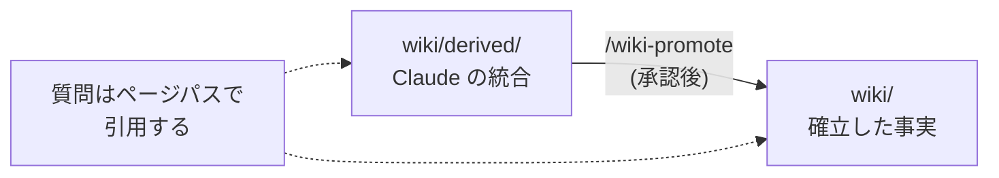
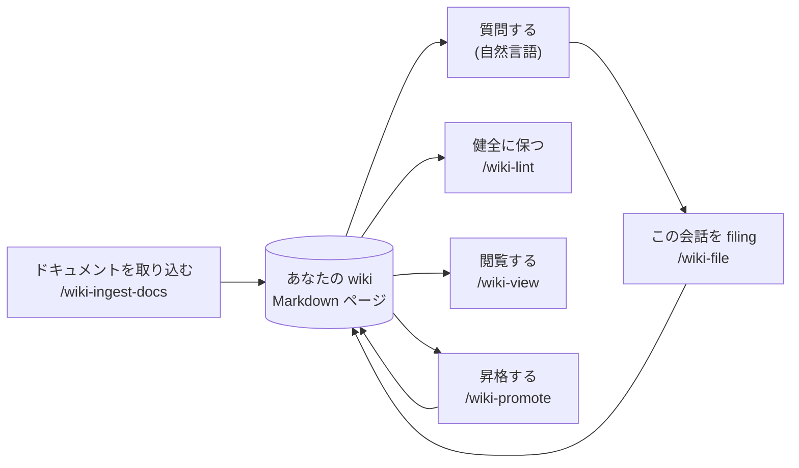
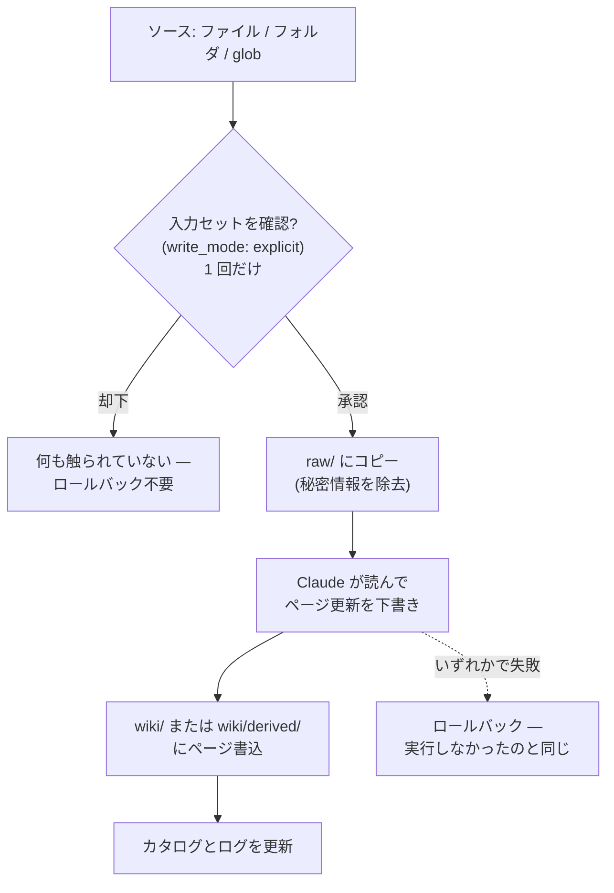

# llm-wiki — ユーザーガイド

llm-wiki を日々**使う**ための、やさしいタスク志向の手引きです。プラグインの内部構造の知識は
前提としません。設計の根拠・コード構成・全オプションの一覧は [README](README_ja.md) を参照
してください。このガイドは *あなたが何をするか* と *何が起きるか* に絞っています。

[English version here](USER_GUIDE.md)

---

## 1. llm-wiki とは（1 分で）

llm-wiki は、散らばったソース — ドキュメント、メモ、コマンド出力、チャット/セッションログ —
を、Claude が執筆・更新しつづける小さな **Markdown ページの wiki** に変え、そこに**質問を
投げて答えを得られる**ようにするものです。

最初に知っておくとよい 2 点：

- **wiki はただのフォルダ。** ソース素材・Claude が書いたページ・カタログ・ログを保持します。
  データベースもサーバーもありません。すべてのファイルを自分で開けますし、バージョン管理する
  かどうかも自由です — llm-wiki が git に触れることは一切ありません。
- **信頼度は「ページの置き場所」で決まる。** `wiki/` 配下のページは、引用できる確立した事実
  として扱われます。`wiki/derived/` 配下は Claude 自身の統合（synthesis）で、あなたが明示的に
  *昇格（promote）* するまで分離されたままです。どちらかはフォルダを見れば常に分かります。



操作はすべて Claude Code 経由 — いくつかのスラッシュコマンドと、ふつうの自然言語の質問だけです。

---

## 2. 始める前に

- プラグインを入れた **Claude Code**：

  ```
  /plugin marketplace add gigamori/ai-agent-toolkit
  /plugin install llm-wiki@ai-agent-toolkit
  ```

- PATH に **[uv](https://docs.astral.sh/uv/)**。プラグインはエンジンを `uv run` で動かすので、
  ほかに何もインストールしません。日々の読取/質問の経路は**追加依存ゼロ**です。

プラグインを有効化すれば、wiki の中で作業を始めた瞬間に自動で有効になります — 別途「オンにする」
手順はありません。

---

## 3. wiki を作る

実行：

```
/wiki-init
```

置き場所を尋ねられ、wiki がただのフォルダとして作成されます。メニューを飛ばしたいときは、
場所を直接指定します：

```
/wiki-init --root ./path/to/wiki
```

以上です — 空のカタログ、ログ、そして使ううちに埋まっていく `raw/` と `wiki/` サブフォルダを
含む wiki フォルダができます。

---

## 4. 日々のループ

wiki フォルダの中で作業します（またはどのコマンドにも `--root <path>` を渡せます）。毎ターン
Claude が `active wiki: <path>` のような行をそっと表示するので、どの wiki にいるか常に分かり
ます。wiki の外では、プラグインは完全に邪魔をしません。



### ドキュメントを取り込む — `/wiki-ingest-docs`

コマンドは**何を入れるか**で命名されています：ドキュメントか、今している会話か、他セッションの
ログか。ドキュメントならファイル・フォルダ・クォートした glob を指定します：

```
/wiki-ingest-docs ./docs/rfc-routing.md     # 1 つのドキュメント
/wiki-ingest-docs "./docs/**/*.md"          # 複数ファイルを一括（glob はクォート！）
/wiki-ingest-docs ./docs/                   # フォルダまるごと（テキストファイルのみ）
```

答えが原典を引用できるよう、リンクを添えることもできます：

```
/wiki-ingest-docs ./docs/rfc.md external=https://example.com/rfc
```

そのリンクがどこに残るか：wiki 自身の **source-ref 台帳** — wiki root にある
`.llmwiki.source-ref.jsonl` というファイルです。取り込んだソースごとに 1 行が追記され、
リンクと一緒に `raw/` 配下のコピーのパス・content hash・日付が記録されます。ページ本体に
書き込まれるわけではありません。あなたのマシンに関する情報は入りません：ローカルの絶対
パスは決して記録されません。台帳を書くのは Claude ではなくエンジンで、他のすべてと同じ
トランザクションの中にあります — ingest がロールバックすれば、その行も一緒に消えます。

このリンクは**ドキュメント専用**です。`/wiki-file` と `/wiki-ingest-sessions` は
transcript を対象にしており、指し示すべき外部の原典が存在しないため、`external=` を
そもそも受け付けません — そこで指定した場合は、黙って無視されるのではなく明確に拒否
されます。

現時点で知っておくとよいことが 2 つあります。すでに wiki が持っているドキュメントを
再度取り込んでも何も変わりません（重複としてスキップされるため、行も記録されません）。
そして、この台帳が存在する前に作った wiki もこれまでどおり動きます — 古いソースには
単にリンクが記録されていないだけで、後から埋めることはできません。コピーから元の
アドレスを復元することはできないためです。

何が起きるか：**最初に確認が求められます**。読込もコピーも行われる前の時点で、有効な設定が
1 行で示されます。フォルダや glob を指定した場合も**一括で 1 回だけ**訊かれ、ファイルごとに
訊かれることはありません — この確認は「出力」ではなく「何を入れるか」を対象にしているためです。
却下した時点ではまだ何も触られていないので、ロールバックすべきトランザクションは存在しません。
承認すると、各ソースが `raw/` にコピーされ（先に秘密情報が除去されます）、次に Claude が
それを読んで関連ページを執筆・更新します。途中で問題が起きれば、そのソースの変更はきれいに
ロールバックされ、実行しなかったのと同じ状態に戻ります。複数ファイルを一括で取り込むときは
各ファイルが独立したトランザクションで処理され、最後に `成功 / 失敗 / スキップ` のサマリが出ます。

非対話の呼び出し元（`claude -p` やスクリプト）は回答できないため、推測して進めるのではなく
何も書かずに停止します。そのような実行を進めたい場合は `write_mode=implicit` を意図的に指定して
ください。



### セッション集合を取り込む — `/wiki-ingest-sessions`

`/wiki-file` は今いる会話を扱います。**解決されたセッション集合の全 Claude Code セッション**を
（別の日のものも含めて）まとめて取り込みたいときは、セッション集合版のコマンドを使います：

```
/wiki-ingest-sessions                 # 解決済み wiki scope（workspace/pj/cwd）に追従
/wiki-ingest-sessions --workspace     # workspace のどこかに登録された全セッション
/wiki-ingest-sessions --pj my-proj    # 名前付きプロジェクトに紐づくセッションのみ
```

フラグ無しでは、セッション集合は**active な wiki の解決済み scope に追従**します —
workspace-scoped wiki なら workspace の各プロジェクトが登録した全セッションを union、
pj-scoped wiki ならこのセッション自身の active project を解決、standalone/legacy な
cwd-scoped wiki は従来どおり現在プロジェクトのセッションディレクトリを直接解決します
（直下の単一フォルダとして解決された wiki も cwd と同じ扱いになります）。

セッション集合を解決し、各セッションを **1 つずつ** 取り込み（それぞれ独立したトランザクション
なので、1 つの不良セッションが他を巻き込むことはありません）、`成功 / 失敗 / スキップ` のサマリに
加えて、解決したセッション数とスキップした turn 数を表示します。

押さえておくとよい 2 点：

- **incremental で、再実行しても安全です。** 各 turn は初回に file した時点で（小さな台帳＝ledger に）
  記憶されるので、プロジェクトの成長に伴って再実行しても *新しい* turn だけが file されます — 同じ
  turn が 2 度 file されることはなく、`/wiki-file` と `/wiki-ingest-sessions` を跨いでも同じです。
  サマリの **ledger-skipped turns** 数が既に取り込み済みだった分を教えてくれるので、再実行が無音の
  no-op になることはありません。
- **`--pj`（および `--workspace`）は taskflow がタグ付けした分だけが対象です。** `--pj <name>` を
  付けると、スコープは taskflow がそのプロジェクトに登録したセッション。`--workspace` はこれを
  全プロジェクトの登録セッションに拡げます — いずれもディスク上の全セッションではありません。
  taskflow に依らず standalone/legacy プロジェクトの全 CC セッションを取り込むには、cwd-scoped
  wiki でフラグ無しにし、プロジェクトのセッションディレクトリを自動解決させます。

### 質問する — ただ尋ねる

コマンド不要。自然言語で尋ねます：

> retry backoff について何を決めた？

Claude はページ全体を読んで答え、**各要点をページパスで引用**するので、それが確立ページ
（`wiki/…`）由来か統合ページ（`wiki/derived/…`）由来かが分かります。質問は何も変更しません —
読取専用です。

### この会話を filing する — `/wiki-file`

頼まないかぎり何も保存されません。一番よく残したくなるのは今しがたの会話なので、それには専用の
コマンドがあります：

```
/wiki-file                          # この会話を filing
/wiki-file 最後の回答だけ             # 絞り込む
/wiki-file retry-policy の話だけ      # トピックで絞る
```

セッション ID もパスも入力不要です — `/wiki-file` は自分がどの会話にいるかを既に知っています。
`/wiki-file` の行の直前で打ち切られます。その行は会話の一部ではなく wiki への指示だからです。
直前の回答までは filing されます。

既定の `write_mode=explicit` では、`/wiki-file` はまず対象ページの一覧（どれが新規で
どれが更新か）を提示し、あなたが承認するまで何も書き込みません。

**何度でも実行できます。** 各 turn は最初に filing された時点で記憶されるので、2 回目の実行は
新しい分だけを拾います。早めに filing して作業を続け、後でもう一度 filing しても重複しません。

コマンド後の文字列は *どの turn を* filing するかを絞ります。内容を変えることはできません：
Claude にできるのは turn ごと落とすことだけで、エンジンが残った各 turn の指紋を再照合するため、
filing された turn は必ず本物です。

あるいは会話の流れで頼んでも構いません：*「それをページとして保存して」*。他の filing と同じく
`wiki/derived/` に統合として保存されます。

### 健全に保つ — `/wiki-lint`

```
/wiki-lint
```

読取専用。wiki のリンクとカタログの問題を検査し、解決する価値のある「次の問い」を優先度付きで
返します。何も編集しません。transcript の claim が明確な yes/no シグナルを伴わない箇所も検出します
— 現状は英語専用です（日本語の transcript を扱う場合は §7 参照）。

### 閲覧する — `/wiki-view`

```
/wiki-view
```

`http://127.0.0.1:17330/` に小さなローカル Web ビューアを立ち上げ、ページを描画して
`[[wikilinks]]` をクリックで辿れるようにします。各ページには **source / derived** のバッジが
付きます。公開されるのは `wiki/` のページだけで、`raw/` のソースは決して露出しません。停止：

```
/wiki-view-stop
```

この専用スキルがポート（17330）を解放し、POSIX でも Windows でも動きます。非既定ポートで
起動した場合は `--port <n>` を渡してください。

### ページを昇格する — `/wiki-promote`

`wiki/derived/` の統合が実証され、確立した事実として扱いたくなったら：

```
/wiki-promote wiki/derived/retry-policy.md
```

承認すると `wiki/retry-policy.md` へ移動し、そこを指すリンクも修正されます。これが derived から
確立 tier へページが渡る**唯一**の方法です — つまり信頼境界は常にあなたが意図して行う選択です。

---

## 5. プロジェクトをまたいで使う（taskflow 統合）

**taskflow** プラグインも併用している場合、llm-wiki はアクティブなプロジェクトに自動で
追従します — wiki を手作業で切り替える必要はありません。

アクティブな wiki は、次のうち存在する最初のものを順に選んで決まります：

1. **コマンドに渡した明示的な `--root <path>`** — 常に最優先。
2. **アクティブな taskflow プロジェクトの wiki** — `<project-root>/<project>/wiki/`。
   taskflow が現在アクティブにしているプロジェクトのものが使われます。プロジェクトを
   切り替えると wiki が切り替わるのは、これによるものです。
3. **ワークスペースの wiki** — ワークスペース直下の `_llm-wiki/`。
4. **カレントフォルダ** — wiki の中にいる場合。
5. **直下にある単一の wiki フォルダ** — カレントフォルダ自体は wiki ではないが、その中の
   フォルダがちょうど 1 つだけ wiki の場合、それが使われます。wiki の*親*フォルダを開いて
   しまう頻出のケースを救済するものです。見るのは 1 階層下のみで、それより深くは探しません。
   直下に **2 つ以上**の wiki がある場合は、あえてどれも選びません（推測で選ぶと別の wiki へ
   書き込みかねないため）— wiki フォルダ自体を開くか、`--root` を渡してください。

したがって、プロジェクトごとに参照する wiki を切り替えるには、taskflow のプロジェクトを
切り替える（`pj:<project>`）だけです。次のコマンドはそのプロジェクトの `wiki/` を使います。
一回限りの指定は `--root` を渡してください。

連携は**一方向**です：llm-wiki は taskflow のアクティブプロジェクト情報を読むだけで、
taskflow へは一切書き込みません。アクティブなプロジェクトが無い場合、あるいはその
プロジェクトにまだ `wiki/` が無い場合、llm-wiki は静かにワークスペースやカレント
フォルダへフォールバックします — 自分から wiki を作ることはありません（それは
`/wiki-init` の役目）。

プロジェクトルートは `$TASKFLOW_PROJECT_ROOTS`（`;` 区切り）から取得します。未設定なら
ワークスペースの `_projects/` 以下を探します。

### プロジェクトごとに一度だけ設定する

1. taskflow でそのプロジェクトに切り替える（`pj:<project>`）。
2. `/wiki-init` を実行し、提示される `<project-root>/<project>/wiki/` を受け入れる
   （プロジェクトがアクティブなときは第一候補として提示されます）。

以降、そのプロジェクトでの毎ターン、そのプロジェクトの wiki が自動で解決されます —
Claude は回答時にそれを読み、`active wiki:` 行に `(scope: pj)` タグが表示されます。

**並行セッションでも安全です。** 各セッションは *自分自身* がいるプロジェクトを解決します
— したがって別プロジェクトの 2 つのセッションを同時に走らせても、互いの wiki を
取り違えることはありません。

### セッション単位で wiki を off/on する — `wiki:on` / `wiki:off`

wiki が解決されている限り、**既定は on** です。現在のセッションだけ静かにしたい —
読み取りも filing 提案もしない — 場合は、メッセージのどこかに `wiki:off` を入れます：

```
ちょっとしたシェルの質問だけ、wiki は不要  wiki:off
```

off の間、Claude は返答の冒頭に `[wiki:off]` を出し、wiki には一切触れません。`wiki:on`
で戻せます。on のターンでは冒頭に `[wiki:on]` が出ます（taskflow の `[pj:…]` と同様）。
切替は**セッション単位で、その中では sticky**（次に切り替えるまで保持）で、**新しい
セッションは常に on** で始まります。off 状態は **wiki ごと**に記憶されます：セッション
途中でプロジェクトを切り替える（`pj:<other>`）と、新たに解決された wiki は on で現れ、
元に戻すと以前の off が復活します。（*恒久的な* off は、代わりに wiki の `SCHEMA.md` の
`activation_scope` を設定してください。）wiki が一切解決されない場合、`wiki:on|off` は
何もしません — 切り替える対象が無いからです。

### 節目で `/wiki-ingest-sessions` を回して wiki を最新に保つ

pj 連携により Claude は wiki を自動で *読み* ますが、セッションが wiki に *書き込まれる*
のは指示したときだけです。自然な節目（作業の区切り、ハンドオフの前）で、プロジェクトの
セッションを取り込みます：

```
/wiki-ingest-sessions --pj <project>
```

インクリメンタルで再実行安全です — ターン台帳により *新しい* ターンだけが filing される
ので、何度実行しても重複しません（§4 参照）。

---

## 6. 便利なレシピ

- **docs ツリーを一括取り込み：** `/wiki-ingest-docs "./docs/**/*.md"` — シェルが展開しないよう glob は
  必ずクォート。wiki 内部ファイルは自動で除外されます。
- **メモやログを含むフォルダを取り込み：** `/wiki-ingest-docs ./notes/` — フォルダはテキストファイル
  （`.md .markdown .txt .text .json .jsonl`）を拾い、画像やバイナリはスキップします。
- **大きな wiki の全文検索を有効化（任意）：** 次節を参照。

### 大きな wiki 向けの高速検索（任意）

既定では質問は全ページを走査します — 小〜中規模の wiki には最適で、追加セットアップは不要です。
大きな wiki には、オンデバイスの全文検索エンジン **qmd**（別途インストール）に opt-in できます。
wiki の `SCHEMA.md` で `search_backend: qmd` を設定し、一度インデックスを構築します：

```
/wiki-reindex
```

大きな取り込みの後は再度 `/wiki-reindex` で更新します。qmd が保存するものはすべて wiki の中
（`.qmd/` フォルダ）に留まり、`raw/` のソースはインデックスされません。qmd が未インストールだったり
問題が起きた場合、質問は自動的に通常の走査へフォールバックし、その旨を伝えます — 壊れません。

---

## 7. うまくいかないとき

**「別の取り込みが実行中」と出るが実行していない。**
途中で kill された取り込みは、古いロックを残すことがあります。単独のロックだけ（進行中の
トランザクションが無い）を残した場合は何もする必要はありません：次の取り込みが、前のプロセスが
消えていることに気づいてロックを自動で解除します。ただしトランザクションの途中で kill された
場合（ジャーナルが残っている）、あるいはロック所有者を確認できない場合は自動解除され**ません** —
中断した取り込みを明示的にロールバックします：

```
uv run --script ${CLAUDE_PLUGIN_ROOT}/bin/llmwiki-ingest ingest abort <wiki-root>
```

これは wiki を、中断した取り込みの *前* の状態に戻し（書きかけのソースを除去し）、ロックを解放
します。取り込みがごく早い段階で中断されていても安全に実行できます。

**取り込みが途中で止まり、ロックが残ったのにページが書かれていない。**
`/wiki-ingest`（および `/wiki-ingest-sessions`）は多段のオーケストレーションで実行されます。とても
小さい/高速なモデルでは途中のステップを取りこぼし、中断された取り込みと同様にトランザクションが
open のまま残ることがあります。取り込みには能力の高いモデルを使い、止まった取り込みの解消は上記と
同じ `abort` を使ってください。

**`.jsonl` ファイルの取り込みが拒否された。**
`.jsonl` ファイルは、Claude Code や pi のセッションログとして認識されない限り既定で拒否されます —
llm-wiki は未確認の `.jsonl` を黙って plain text として扱うことはしません（セッションログを誤って
一般テキストとして取り込むと transcript の信頼境界が壊れるため）。そのファイルが本当に plain-text
の `.jsonl` データファイル（セッションログではない）であれば、その旨を伝えてください — 推測せず、
plain text として扱って取り込みが再試行されます。

**`/wiki-file` が "cc session file not found" で停止した。**
`/wiki-file` は「いま行っている会話」を filing しますが、その実体はそのセッション自身のログ
ファイルの読み取りです。Claude Code のどのログ保存場所にもこのセッションのログが無い場合、取り込みは
即座に停止します — ロックも書込も発生する前なので、ロールバックすべきものはありません。よくある
原因は、Claude Code が `~/.claude` 以外の場所にログを保存していることです。実際に使われている
設定ディレクトリを `CLAUDE_CONFIG_DIR` に指定してから `/wiki-file` を再実行してください。セッション
ID を手入力して再試行しないでください。（2026-08-12 より前はこの場合に停止せず、空の取り込みが
行われていました。それ以前から使っている wiki には、transcript の見出し行だけのソースファイルが
残っている可能性があります。）

**取り込みが「大きすぎる」と拒否された。**
1 回の取り込みで設定上限（ページ数の `max_count`、既定 100。または合計サイズの `max_bytes`、既定
10 MiB）を超えようとすると、黙って数百ページを書く代わりに停止してあなたに委ねられます。大きな
取り込みがバッチに分割される場合でも、byte 合計はバッチごとにリセットされず**取り込み全体を通して**
追跡されるため、個々のバッチは上限内に見えても合算で超える取り込みは検出されます。同じサイズ上限は、
1 件の回答をページとして保存する時にも適用されます。より小さく分けて取り込むか、本当にそのつもり
なら `SCHEMA.md` で上限を上げてください。

**ページの書込が拒否された。**
書込が許されるのは `wiki/` と `wiki/derived/` の中だけです。それ以外 — ソースファイル、カタログ、
wiki の外のもの — への書込は設計上拒否されます。これは安全境界が働いている証拠で、不具合では
ありません。

**検索が「index-direct fallback を使用」と言う。**
任意の qmd backend が使えなかった（未インストール／構築中／空）ため、質問が通常のページ走査を
使ったという意味です。答えは正しいままです。qmd を有効にしていたつもりなら `/wiki-reindex` を
実行してください。

**以前取り込んだソースを再取り込みしたら、重複として認識されず `raw/` に別コピーが増えた。**
2026-07-17 に、ソースを保存する前の redaction が何をマスクするかの修正が入りました（URL や
パスを伴わない裸の `~` は、もう機密パスとして扱われません）。重複判定のハッシュは redaction
**後**のテキストで計算されるため、この修正より前に取り込んだソースは、次に再取り込みしたときに
以前と異なるハッシュになり、同じソースとして認識されず新規ソースとして filing されます —
一度だけ起きる影響で、それ以降の再取り込みは通常どおり重複判定されます。セッションログの
取り込み自体の重複判定（turn ledger）は別の仕組みで、この影響を受けません。

**`/wiki-lint` が日本語 transcript のあらゆる decision をフラグする。**
`/wiki-lint` が検査する decision floor は、英語の affirmation フレーズ（"approved" "lgtm"
"sounds good" など）しか認識しません。日本語の transcript では、現状すべての decision 候補が
このチェックに失敗しフラグされます — これは既知の制限（日本語の肯定/否定を同じ方式で確実に
検出するのは非現実的）であり、wiki が壊れているわけではありません。日本語 transcript で
フラグされた decision は、floor の判定ではなく自分の目で確認してください。fail する方向は
安全側（over-flag であり、実際には合意していない claim を黙って承認することはない）です。

---

## 8. 触ることがあるかもしれない設定

設定はすべて wiki の `SCHEMA.md`（`config:` の下）にあります。変える必要はめったになく、既定で
妥当です。知っておくとよい主なもの：

| 設定 | 既定 | 役割 |
|---|---|---|
| `write_mode` | `explicit` | ページ書込前に確認する。`implicit` にするとプロンプトを省略（セッション開始時に大きく告知）。 |
| `apply_fanout_k` | `10` | 1 回の取り込みが、作業をバッチ分割する前に一度に扱うページ数。 |
| `max_count` | `100` | 1 回の取り込みが書ける最大ページ数。これを超える取り込みは無人実行せずあなたに委ねられる。 |
| `search_backend` | `index` | `index` = 全ページ走査（セットアップ不要）。`qmd` = opt-in の全文検索（§6 参照）。 |

設定変更は、その wiki の中だけに適用されます — 他の wiki に漏れることはありません。

---

## さらに詳しく

このガイドは一般的な流れを扱います。全コマンドのリファレンス、全設定、安全モデル、設計の根拠は
[README](README_ja.md) を参照してください。
