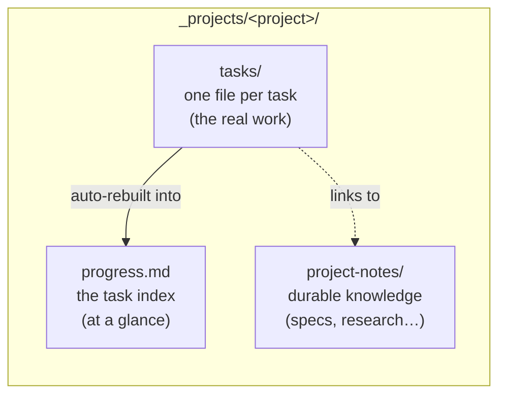
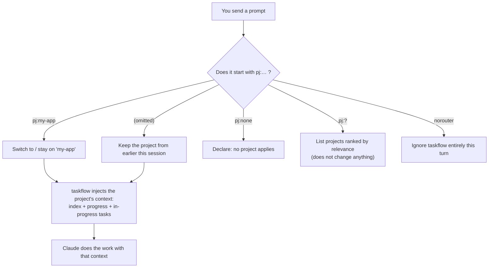
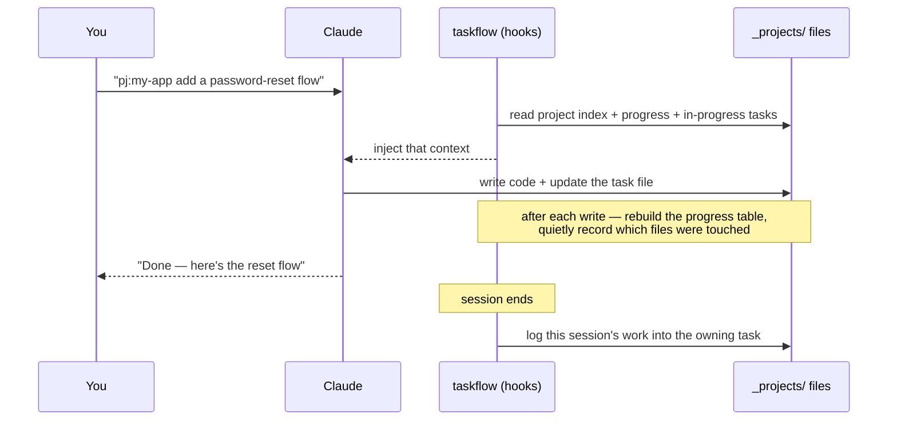
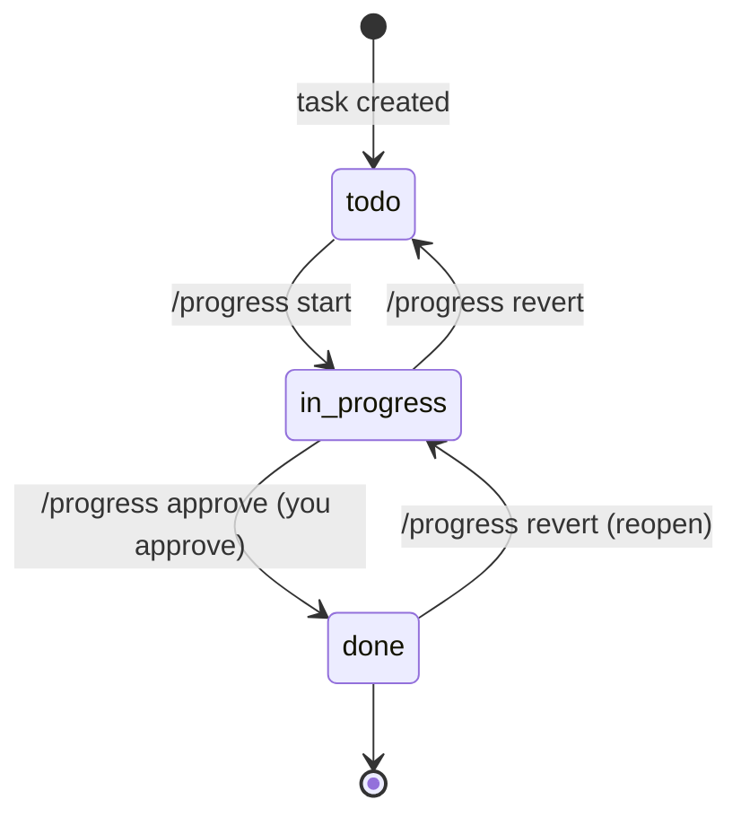
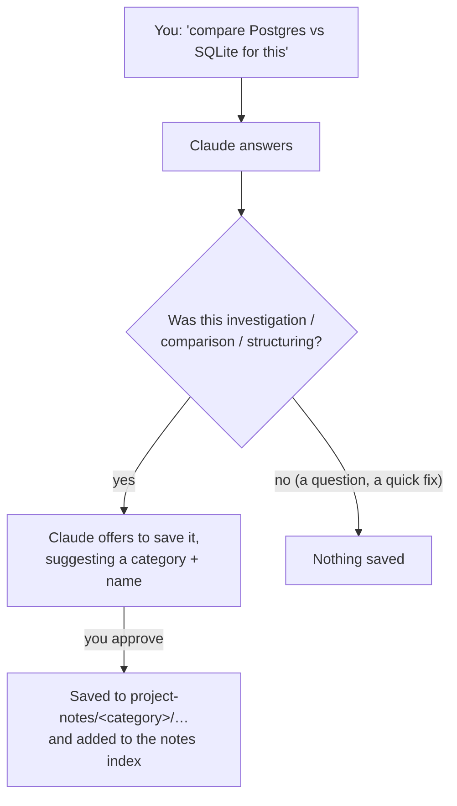
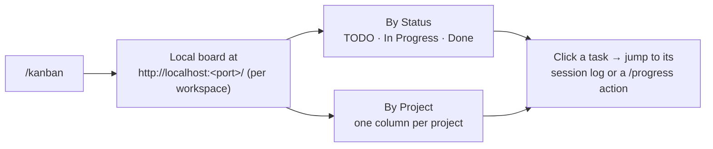
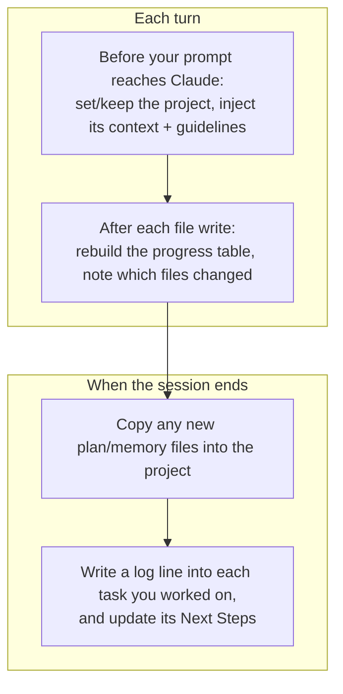

# taskflow — User Guide

A friendly, task-oriented guide for everyday use. If you want the internal design, read [`docs/architecture.md`](docs/architecture.md); for a feature reference read the [README](README.md). This page shows you how to *use* taskflow.

[日本語版はこちら](USER_GUIDE_ja.md)

---

## 1. What taskflow does for you

When you work with Claude Code across many sessions and several parallel efforts, two things get lost:

- **Which project am I in, and what was I doing?** — every new session starts blank.
- **Where did that decision / research / half-finished task go?** — it lives only in a past chat you can't easily find.

taskflow fixes this by keeping a small set of Markdown files per project and automatically feeding the right ones back into Claude at the start of each turn. You keep working in plain language; taskflow keeps the memory.

### The mental model: three stores per project



| Store | Think of it as | You edit it… |
|---|---|---|
| **`progress.md`** | The dashboard — a table of every task and its status | Rarely — the table is auto-generated |
| **`tasks/`** | Sticky notes, one per task, filed by status folder | Through `/progress` commands and normal work |
| **`project-notes/`** | The project's filing cabinet of lasting knowledge | By asking Claude to "save this to notes" |

You mostly talk to Claude normally. taskflow does the filing.

---

## 2. Getting started (nothing to configure)

1. Install the plugin:

   ```
   /plugin marketplace add gigamori/ai-agent-toolkit
   /plugin install taskflow@ai-agent-toolkit
   ```

2. On your **first use of `pj:<project>`** in a workspace, taskflow automatically creates the `_projects/` folder and an empty project index — no setup step.

3. Start naming a project (next section).

> **Claude Code only.** taskflow relies on Claude Code's ability to inject context every turn, which Cursor's equivalent hook cannot do. It will not work on Cursor.

---

## 3. Choosing a project with `pj:`

Every session belongs to at most one project. You declare it by putting `pj:<name>` near the beginning of your prompt.



| You type | What happens |
|---|---|
| `pj:my-app fix the login bug` | Work on project `my-app` |
| `fix the next thing` (no `pj:`) | Stays on whatever project you set earlier |
| `pj:?` or `pj:? billing pipeline` | Claude lists the closest-matching projects so you can pick |
| `pj:none write a quick script` | You're telling taskflow this isn't project work |
| `norouter just answer this` | One-off — taskflow stays completely out of the way |

Key rule: **taskflow never guesses your project.** If you don't name one and haven't set one, it simply stays out of the way.

### Creating a new project

Just ask: *"create a new project called billing-revamp"*. Claude will confirm, then scaffold the project's `index.md`, `progress.md`, and `project-notes/index.md` and add it to the master index. You approve before anything is created.

---

## 4. The daily loop

Here's what a normal working session looks like end to end.



You never run those middle steps. You give an instruction, Claude works, and taskflow keeps `progress.md` and the task log current on its own.

---

## 5. Managing tasks with `/progress`

`/progress` is your one command for looking at and moving tasks. You can use plain language after it — Claude figures out the action and the target, shows you the plan, and asks before making destructive changes.

### Task lifecycle

A task is just a file, and its **folder is its status**:



| What you want | Say something like |
|---|---|
| See what needs attention (drift, stale, waiting) | `/progress check` |
| Classify every task by remaining work | `/progress audit` |
| Start a task | `/progress start migration` · `/progress 着手 migration` |
| Mark a task done (needs your OK) | `/progress approve migration` · `/progress 完了 migration` |
| Send a task back / reopen | `/progress revert migration` |
| Refresh the dashboard table | `/progress rebuild` |

- Moving a task **into Done always requires your explicit approval** — Claude will never auto-complete a task.
- Add `-y` to skip the confirmation when you're sure (e.g. `/progress 全部完了 -y`).
- If your wording matches nothing (or several things ambiguously), Claude stops and lists candidates instead of guessing.

### What a task file looks like

You rarely edit this by hand, but it's just Markdown:

```markdown
---
priority: HIGH
created: 2026-05-13
updated: 2026-05-14
---

# Add password-reset flow

Notes about the work go here (free to rewrite).

## Next Steps
- wire the email template
- add tests

<!-- @log:begin -->
- 2026-05-13 [s:abc12345]: started
- 2026-05-14 [s:def67890]: form + endpoint done | next: email template
<!-- @log:end -->
```

- **`## Next Steps`** is the honest "what's left" list. The guidelines instruct the agent to rewrite it at the end of every turn that advances the task; `/progress audit` verifies it.
- The **`@log` block is the history** — append-only, one line per session, so you can always see how a task progressed and jump back to the exact session that did the work.

---

## 6. Saving knowledge to project-notes

Tasks are temporary; some findings should outlive them. `project-notes/` is where durable knowledge lives, filed by category.



| Category | For |
|---|---|
| `specs/` | Designs, decisions, ADRs |
| `investigations/` | Research, analysis, post-mortems |
| `checks/` | Checklists, verification items |
| `procedures/` | Step-by-step how-tos for humans |
| `backlog/` | Ideas, candidate work |
| `_archive/` | No longer authoritative |

How to use it, in plain language:

| You say | Result |
|---|---|
| "save this research to notes" | Claude files it and updates the notes index |
| "what's in notes?" | Claude lists the relevant notes (titles only) |
| "summarize this repo's structure into notes" | Claude investigates, then offers to save |

For investigation-style requests, Claude will *proactively offer* to save — you always approve first, and it only saves on a yes. Plain questions, debugging, and trivial edits don't trigger the offer.

---

## 7. Seeing everything at once — `/kanban`

Run `/kanban` to get a visual board of every project and task.



- It starts a small local server in the background and prints the URL plus the command to stop it.
- Two toggleable views (by status, by project), priority badges, and filtering by project/status.
- Clicking a task's session history opens the exact session that worked on it.

---

## 8. What taskflow does automatically

You don't manage any of this — it's here so you understand *why* your files stay current. taskflow runs small scripts at fixed moments:



Two conveniences worth knowing about:

- **Automatic logging.** Even if you edited files *outside* a task's own file, taskflow can still attribute the work to the right task, so its history stays complete without you bookkeeping.
- **Note ↔ task links.** When a session produces a lasting note, taskflow records a link from the owning task to that note, so the two stay connected even if things get renamed later.

The system uses append-only writes and bounded locking for protection, and the automatic table in `progress.md` is always rebuildable from the task files. The known residual risk is R-lock (concurrent append with the tool layer's Edit), which is logged to stderr.

---

## 9. Quick reference

| Goal | Do this |
|---|---|
| Work on a project | Start your prompt with `pj:<name>` |
| Find the right project | `pj:?` |
| One-off, ignore taskflow | Start with `norouter` |
| Create a project | Ask: "create a new project called …" |
| Start / finish / reopen a task | `/progress start\|approve\|revert <name>` |
| Health check tasks | `/progress check` · `/progress audit` |
| Refresh the dashboard | `/progress rebuild` |
| Save durable knowledge | "save this to notes" |
| See everything | `/kanban` |

**Golden rules**

1. taskflow never *guesses* your project — you name it, or it stays quiet.
2. A task only reaches **Done** with your explicit approval.
3. Don't hand-edit the auto-managed regions (`progress.md`'s `@table`, a task's `@log` / `@notes`); ask Claude or run `/progress rebuild` instead.
