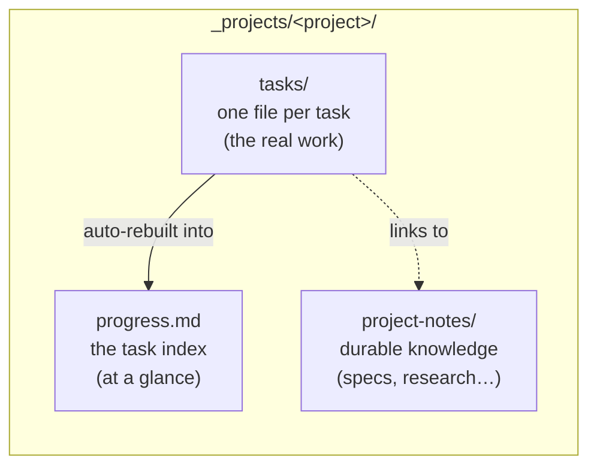
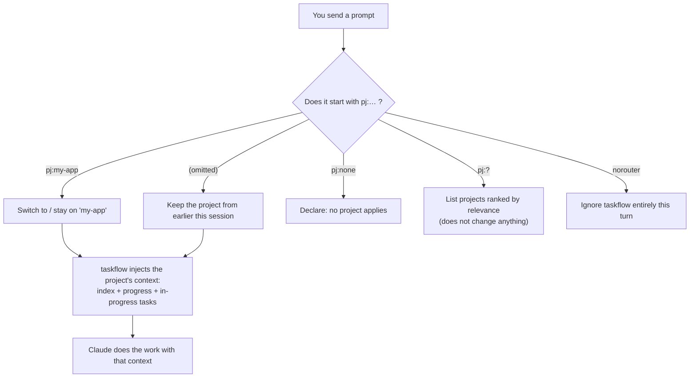
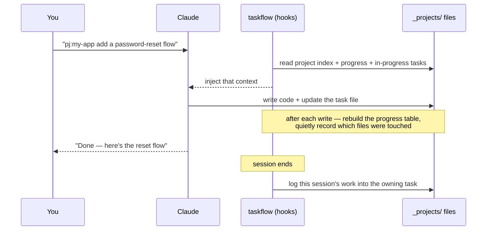
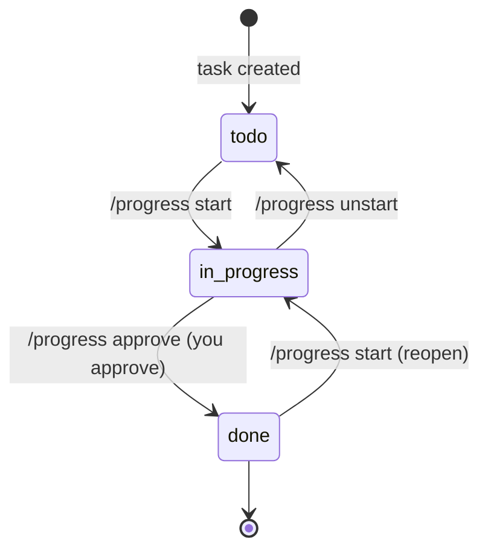
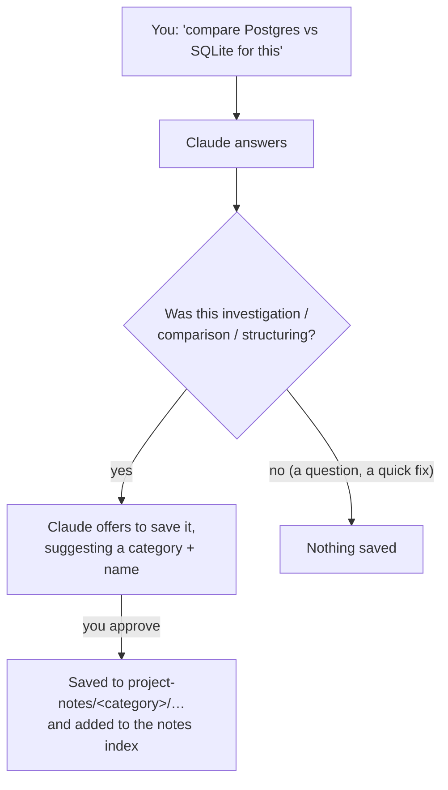
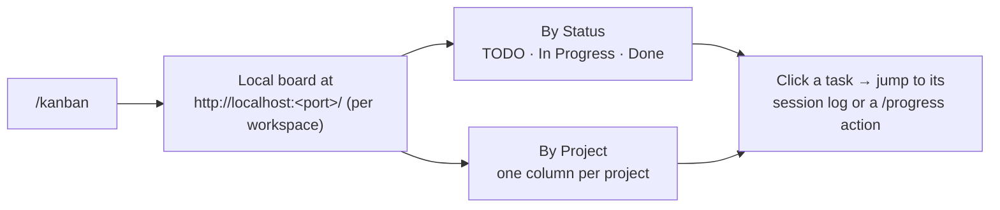
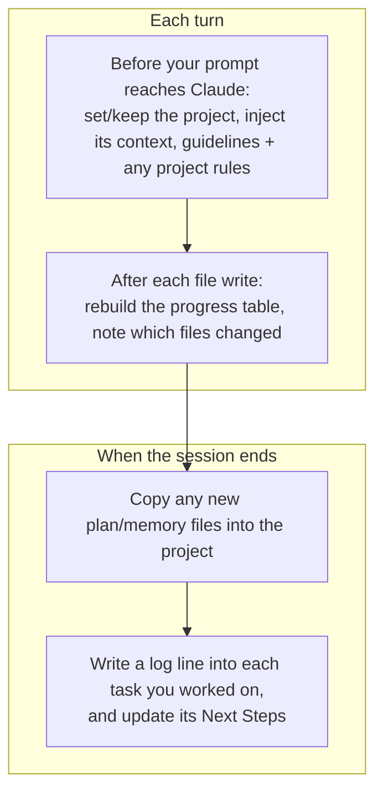

# taskflow — User Guide

The accuracy-first reference for using taskflow. New to taskflow? Start with [Get Started](GET_STARTED.md). For the internal design, read [`docs/architecture.md`](docs/architecture.md); for a feature reference read the [README](README.md).

[日本語版はこちら](USER_GUIDE_ja.md)

---

## 1. What taskflow does for you

When you work with Claude Code across many sessions and several parallel efforts, two things get lost:

- **Which project am I in, and what was I doing?** — every new session starts blank.
- **Where did that decision / research / half-finished task go?** — it lives only in a past chat you can't easily find.

taskflow fixes this by keeping a small set of Markdown files per project and automatically feeding the right ones back into Claude at the start of each turn. You keep working in plain language; taskflow keeps the memory.

### The mental model: three stores per project



| Store | Think of it as | You edit it… |
|---|---|---|
| **`progress.md`** | The dashboard — active tasks, plus the full table of completed ones (Claude is shown only the most recent) | Rarely — the table is auto-generated |
| **`tasks/`** | Sticky notes, one per task, filed by status folder | Through `/progress` commands and normal work |
| **`project-notes/`** | The project's filing cabinet of lasting knowledge | By asking Claude to "save this to notes" |

You mostly talk to Claude normally. taskflow does the filing.

---

## 2. Getting started (nothing to configure)

1. Install the plugin:

   ```
   /plugin marketplace add gigamori/ai-agent-toolkit
   /plugin install taskflow@ai-agent-toolkit
   ```

2. On your **first use of `pj:<project>`** in a workspace, taskflow automatically creates the `_projects/` folder and an empty project index — no setup step.

3. Start naming a project (next section).

> **Claude Code only.** taskflow relies on Claude Code's ability to inject context every turn, which Cursor's equivalent hook cannot do. It will not work on Cursor.

---

## 3. Choosing a project with `pj:`

Every session belongs to at most one project. You declare it by putting `pj:<name>` near the beginning of your prompt.



| You type | What happens |
|---|---|
| `pj:my-app fix the login bug` | Work on project `my-app` |
| `fix the next thing` (no `pj:`) | Stays on whatever project you set earlier |
| `pj:?` or `pj:? billing pipeline` | Claude lists the closest-matching projects so you can pick |
| `pj:none write a quick script` | You're telling taskflow this isn't project work |
| `norouter just answer this` | One-off — taskflow stays completely out of the way |

Key rule: **taskflow never guesses your project.** If you don't name one and haven't set one, it simply stays out of the way.

### Creating a new project

Just ask: *"create a new project called billing-revamp"*. Claude will confirm, then scaffold the project's `index.md`, `progress.md`, and `project-notes/index.md` and add it to the master index. You approve before anything is created.

---

## 4. The daily loop

Here's what a normal working session looks like end to end.



You never run those middle steps. You give an instruction, Claude works, and taskflow keeps `progress.md` and the task log current on its own.

---

## 5. Managing tasks with `/progress`

`/progress` is your one command for looking at and moving tasks. You can use plain language after it — Claude figures out the action and the target, shows you the plan, and asks before making destructive changes.

### Task lifecycle

A task is just a file, and its **folder is its status**:



| What you want | Say something like |
|---|---|
| See what needs attention (drift, stale, waiting) | `/progress check` |
| Classify every task by remaining work | `/progress audit` |
| Start (or reopen) a task | `/progress start migration` · `/progress 着手 migration` |
| Mark a task done (needs your OK) | `/progress approve migration` · `/progress 完了 migration` |
| Send a task back to TODO | `/progress unstart migration` · `/progress migration を未着手に` |
| Refresh the dashboard table | `/progress rebuild` |

- Moving a task **into Done always requires your explicit approval** — Claude will never auto-complete a task.
- Add `-y` to skip the confirmation when you're sure (e.g. `/progress 全部完了 -y`).
- If your wording matches nothing (or several things ambiguously), Claude stops and lists candidates instead of guessing.

### What a task file looks like

You rarely edit this by hand, but it's just Markdown:

```markdown
---
priority: HIGH
created: 2026-05-13
updated: 2026-05-14
---

# Add password-reset flow

Notes about the work go here (free to rewrite).

## Next Steps
- wire the email template
- add tests

<!-- @log:begin -->
- 2026-05-13 [s:abc12345]: started
- 2026-05-14 [s:def67890]: form + endpoint done | next: email template
<!-- @log:end -->
```

- **`## Next Steps`** is the honest "what's left" list. The guidelines instruct the agent to rewrite it at the end of every turn that advances the task; `/progress audit` verifies it.
- The **`@log` block is the history** — append-only, one line per session, so you can always see how a task progressed and jump back to the exact session that did the work.

### Orchestrating a task's Next Steps (optional)

For a bigger task, you can hand the whole `## Next Steps` list to the **mode-orchestrator** skill, which assigns a mode to each step, splits it at mode boundaries, and runs every step as an isolated turn. This is an opt-in extra — manual step-by-step progress is unchanged and remains the default.

**Rules that must not be dropped:**

- **Only the main agent touches the task file.** Orchestrated turns (subagents) never write to it. The `@log` timestamp and session id are copied verbatim from the `iso_ts=` / `sid=` values in the injected Progress Session context — never computed by hand.
- **If the skill is not available, do not imitate it.** Fall back to manual step progression. An improvised "orchestration" has none of the skill's guarantees — no sufficiency gate, no turn isolation, no reply contract, no recovery loop — while still performing the real source edits.
- **Drive it with a mid-tier or better model.** A weak model does not simply fail — it invents a plausible-looking plan with mode names that do not exist and proceeds, which is the imitation the rule above forbids. Measured: two samples on a small model produced zero correct runs, while two samples on the next tier up produced two.

**Prerequisite — read this first.** mode-orchestrator is **not** part of the taskflow plugin and is not installed by `/plugin install taskflow@ai-agent-toolkit`. It is a standalone skill at `skills/mode-orchestrator/` in the [ai-agent-toolkit](https://github.com/gigamori/ai-agent-toolkit) repository; install it separately (e.g. copy that directory into your skills directory). Without it, everything on this page still works — only this subsection does not apply.

**Before you start:**

1. Confirm mode-orchestrator is available. If it is not, stop here and work the steps manually.
2. Check for an existing run directory (`mode-orchestrator-runs/<task-slug>/`). If one exists, reconcile it against `## Next Steps` **before** starting a new run: drop the steps its index shows as finished, and if a decision request is still unanswered, copy its file path and its question to the top of the list. A stale list would re-run source edits that already happened.
3. Start the task (`/progress start <id>`) if it is not started yet.
4. Commit or stash work in progress. Orchestrated steps edit real files in the shared tree, and the skill provides no rollback.
5. Ask for the run. Point at the task file and name the skill — for example:

   > Run the `## Next Steps` in `_projects/<project>/tasks/1_in_progress/<task>.md` with mode-orchestrator, using `--workflow=dev`.

   `--workflow=dev` is the default for implementation work: it is where the choice of turn kinds and models comes from, which is why the task file itself carries none. Pick a different workflow spec if one fits the task better. Two more flags are worth knowing: `--auto` skips the turn-plan approval, and `--decider` (default: you) decides who answers when a step hits a fork it cannot resolve alone.

**Writing Next Steps so they can be orchestrated:**

- Each line must be a single instruction you could act on as-is. Vague lines ("implement the rest") are rejected by the skill's input gate — that rejection is the quality gate working, not a bug.
- **Do not write mode or model names in the task file.** Choosing them is the orchestrator's job. Express intent with the verb — investigate, design, implement, review, verify. A step whose intent the verb cannot carry is a step that needs rewording.
- Keep design context out of the body: point at the `project-notes/specs/` file instead. The skill passes inputs by path, so a pointer is all it needs.
- **A step that reviews something does not fix what it finds.** If you want the findings acted on, follow it with a step that does the fixing — and write that step as the *same kind of work as what was reviewed*: a review of a design is followed by a step that revises the design; a review of an implementation is followed by a step that revises the implementation. Write it with the verb and the right kind of turn follows by itself.
- Leave out steps that need a live conversation (asking you something, deciding together). Those are surfaced as suggestions rather than run, so a later step depending on one would strand the run.
- Getting the list to this quality is planning, and planning is not automated — orchestration only takes over the execution.

A list that satisfies all of the above. Its five investigate → design → review → implement → review lines were run through the skill's gate and produced a five-turn plan; the two revision lines are what the rule above adds:

```markdown
## Context

- Design: `project-notes/specs/csv-export-error-handling.md`
- Code under change: `src/export.py`

## Next Steps

- Investigate the current error handling in `src/export.py` and its callers
- Design the error classification and retry policy from that investigation and the design note
- Review the design
- Revise the design according to the review findings
- Implement the design in `src/export.py` and add unit tests
- Review the implementation
- Revise the implementation according to the review findings
```

Each line is actionable on its own, the intent is carried by the verb, the context is a pointer rather than a copy, and each review is followed by a revision of the same kind of work.

**Worth it when** the task has four or more steps, or spans two or more kinds of work. Below that, doing it manually is cheaper.

**When the run stops** — whether it finished, hit a blocker, or is waiting on your decision — the main agent appends one `@log` line and rewrites `## Next Steps` with what is left. That rewritten list is the input for the next session; the skill has no resume mechanism of its own and does not need one. Moving the task to Done still requires your explicit approval.

**Limits:**

- Run artifacts under `mode-orchestrator-runs/` are not committed, so a `git clean` in the same tree destroys them. Keep the pre-run commit/stash habit.
- In a non-interactive run (`claude -p`), a step that asks for your decision simply ends the run. The request is preserved on disk, so you can restart from it interactively.

---

## 6. Saving knowledge to project-notes

Tasks are temporary; some findings should outlive them. `project-notes/` is where durable knowledge lives, filed by category.



| Category | For |
|---|---|
| `specs/` | Designs, decisions, ADRs |
| `investigations/` | Research, analysis, post-mortems |
| `checks/` | Checklists, verification items |
| `procedures/` | Step-by-step how-tos for humans |
| `backlog/` | Ideas, candidate work |
| `_archive/` | No longer authoritative |

How to use it, in plain language:

| You say | Result |
|---|---|
| "save this research to notes" | Claude files it and updates the notes index |
| "what's in notes?" | Claude lists the relevant notes (titles only) |
| "summarize this repo's structure into notes" | Claude investigates, then offers to save |

For investigation-style requests, Claude will *proactively offer* to save — you always approve first, and it only saves on a yes. Plain questions, debugging, and trivial edits don't trigger the offer.

### What does *not* go into notes: LLM-to-LLM handoffs

A handoff written for **another Claude session** to pick up — a cross-session brief, a sibling-repo request — is a transient memo, not durable knowledge. It goes to `_projects/<project>/llm-handoff/` instead: a flat directory with no index, no status folders, and no link to `progress.md`. Nothing there is loaded into Claude's context unless you point at it (`@llm-handoff/<filename>`), and you can delete files by hand whenever you like — nothing is distilled out of them first.

A handoff **you** run — an E2E or debug handoff where you are the tester and the filled-in result is worth keeping — is the opposite: it is a durable record and stays in `project-notes/checks/`. What decides the destination is who consumes the document, not the word "handoff".

---

## 7. Seeing everything at once — `/kanban`

Run `/kanban` to get a visual board of every project and task.



- It starts a small local server in the background and prints the URL plus the command to stop it.
- Two toggleable views (by status, by project), priority badges, and filtering by project/status.
- Clicking a task's session history opens the exact session that worked on it.

---

## 8. What taskflow does automatically

You don't manage any of this — it's here so you understand *why* your files stay current. taskflow runs small scripts at fixed moments:



Two conveniences worth knowing about:

- **Automatic logging.** Even if you edited files *outside* a task's own file, taskflow can still attribute the work to the right task, so its history stays complete without you bookkeeping.
- **Note ↔ task links.** When a session produces a lasting note, taskflow records a link from the owning task to that note, so the two stay connected even if things get renamed later.

The system uses append-only writes and bounded locking for protection, and the automatic table in `progress.md` is always rebuildable from the task files. The known residual risk is R-lock (concurrent append with the tool layer's Edit), which is logged to stderr.

### Optional: per-project rules (`rules.md`)

A project can carry a short `rules.md` — project-specific rules you want Claude to follow (e.g. *"edit `src/`, never `dist/` directly"*). They are scoped to the taskflow project, so they switch with `pj:` — unlike a repo-wide `CLAUDE.md`, and unlike path-scoped `.claude/rules`.

- **Set them**: `/pj-rules show` lists what's there; `/pj-rules add a rule that …` (or just ask in plain language) proposes the change as a diff and applies it only after you confirm — there's no way to skip that confirmation, since the file affects every future turn. You can also edit `_projects/<project>/rules.md` by hand. Claude never rewrites this file on its own.
- **How they reach Claude**: on switching into the project the full rules are shown once; on later turns only their `##` headings recur as a reminder to re-read before acting. Keep the file short (default budget ~100 lines; `/pj-rules show` reports the current count). Set `inject_every_turn: true` in the file's frontmatter if you want the full text kept in view every turn.

---

## 9. Quick reference

| Goal | Do this |
|---|---|
| Work on a project | Start your prompt with `pj:<name>` |
| Find the right project | `pj:?` |
| One-off, ignore taskflow | Start with `norouter` |
| Create a project | Ask: "create a new project called …" |
| Start / finish / send back a task | `/progress start\|approve\|unstart <name>` |
| Health check tasks | `/progress check` · `/progress audit` |
| Refresh the dashboard | `/progress rebuild` |
| Save durable knowledge | "save this to notes" |
| View / set project-specific rules | `/pj-rules show` · `/pj-rules add a rule that …` (always diff + confirm) |
| See everything | `/kanban` |

**Golden rules**

1. taskflow never *guesses* your project — you name it, or it stays quiet.
2. A task only reaches **Done** with your explicit approval.
3. Don't hand-edit the auto-managed regions (`progress.md`'s `@table`, a task's `@log` / `@notes`); ask Claude or run `/progress rebuild` instead.
