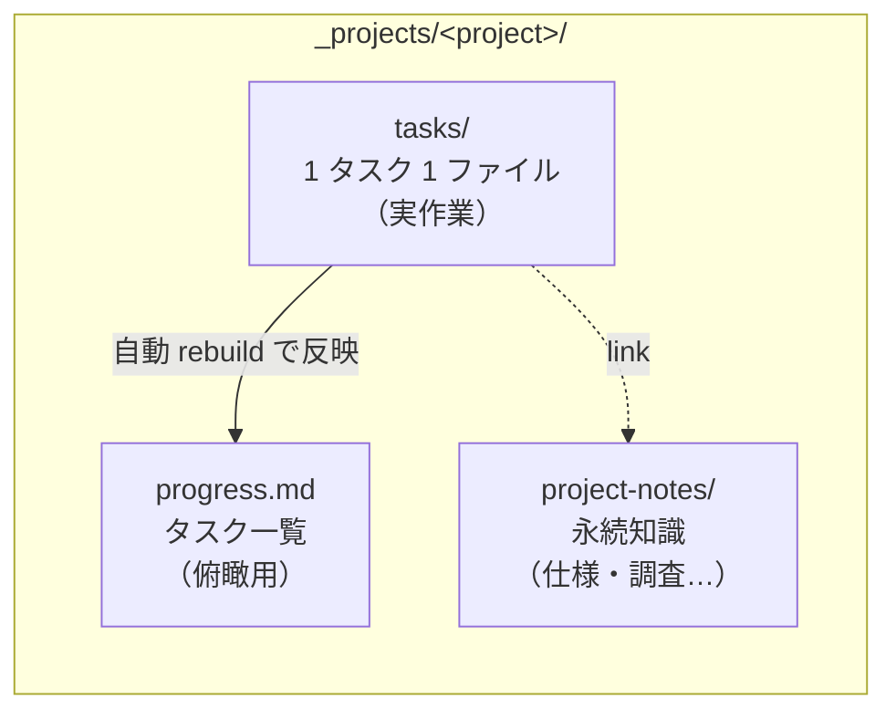
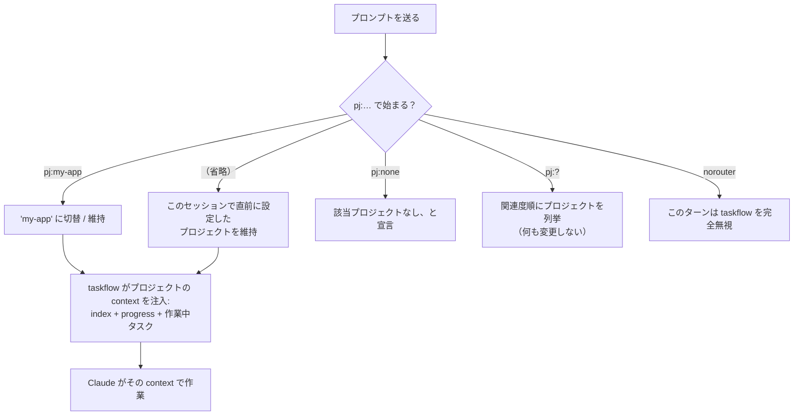
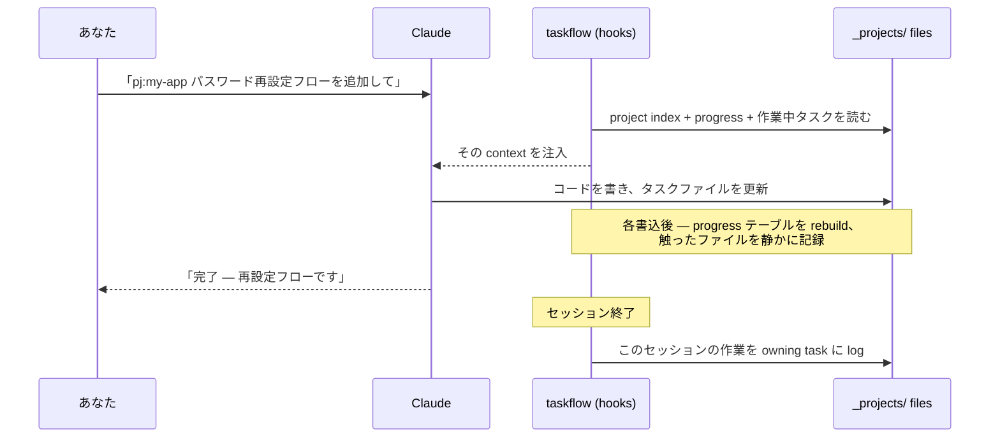
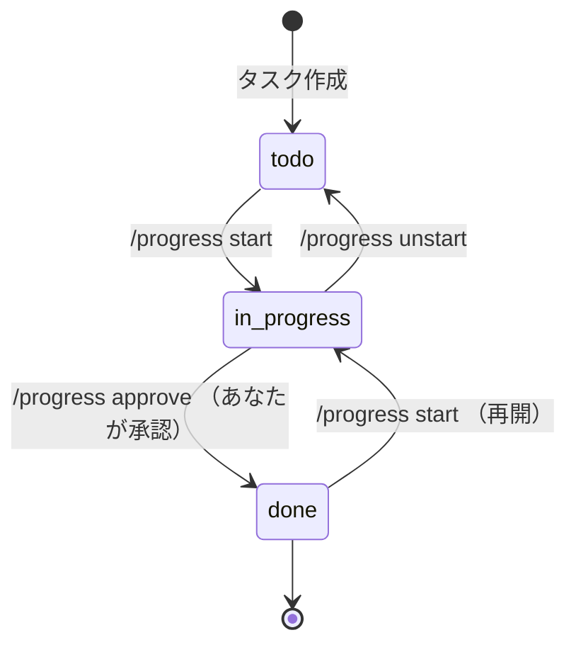
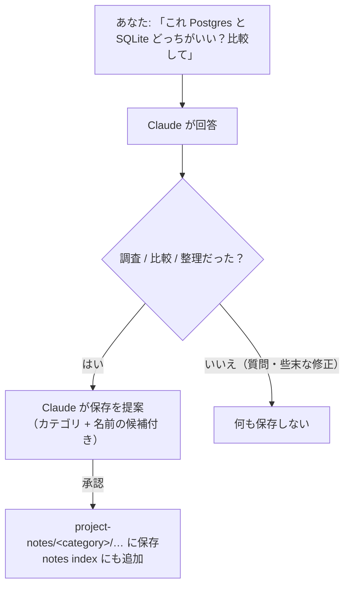
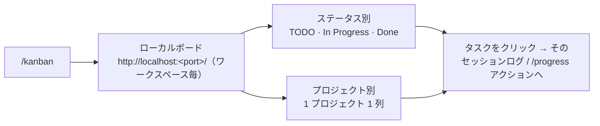
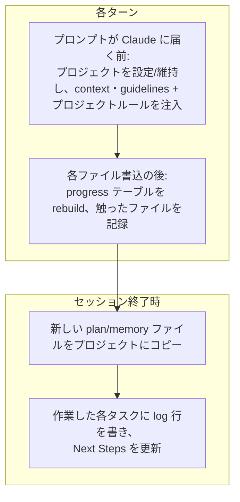

# taskflow — ユーザーガイド

正確さを重視した taskflow の利用リファレンス。初めてなら、まず [はじめよう](GET_STARTED_ja.md) を参照。内部設計は [`docs/architecture.md`](docs/architecture.md)、機能リファレンスは [README](README_ja.md) を参照。

[English version](USER_GUIDE.md)

---

## 1. taskflow は何をしてくれるか

Claude Code で多数のセッション・複数の並行作業をこなすと、2 つのものが失われがちだ。

- **今どのプロジェクトで、何をしていたか** — 新しいセッションは毎回まっさらから始まる。
- **あの決定・調査・やりかけのタスクはどこへ？** — 探しづらい過去のチャットの中にしか残っていない。

taskflow はこれを、プロジェクトごとに小さな Markdown ファイル群を保持し、毎ターンの冒頭で適切なものを自動的に Claude に戻すことで解決する。あなたは普通の言葉で作業を続け、記憶は taskflow が保つ。

### メンタルモデル: プロジェクトごとに 3 つのストア



| ストア | 例えるなら | あなたが編集するのは… |
|---|---|---|
| **`progress.md`** | ダッシュボード — アクティブなタスク＋完了履歴の全件（Claude に見せるのは直近分だけ） | ほぼ不要（表は自動生成） |
| **`tasks/`** | 付箋 — タスクごと 1 枚、状態フォルダに整理 | `/progress` コマンドと通常作業を通じて |
| **`project-notes/`** | プロジェクトの書庫 — 永続的な知識 | 「notes に保存して」と頼んで |

基本はいつも通り Claude と話すだけ。整理は taskflow がやる。

---

## 2. はじめる（設定は不要）

1. プラグインを導入:

   ```
   /plugin marketplace add gigamori/ai-agent-toolkit
   /plugin install taskflow@ai-agent-toolkit
   ```

2. workspace で **初めて `pj:<project>` を使用する**と、taskflow が `_projects/` フォルダと空のプロジェクト index を自動生成する — セットアップ手順は不要。

3. プロジェクトを名指しし始める（次節）。

> **Claude Code 専用。** taskflow は毎ターンのコンテキスト注入に依存しており、Cursor の同等フックはそれを行えない。Cursor 上では動作しない。

---

## 3. `pj:` でプロジェクトを選ぶ

各セッションは最大 1 つのプロジェクトに属する。プロンプトの冒頭（最初のほう）に `pj:<name>` を置いて宣言する。



| 入力 | 起きること |
|---|---|
| `pj:my-app ログインのバグを直して` | プロジェクト `my-app` で作業 |
| `次のやつ直して`（`pj:` なし） | 直前に設定したプロジェクトを維持 |
| `pj:?` または `pj:? 課金パイプライン` | 近いプロジェクトを列挙して選ばせる |
| `pj:none ちょっとしたスクリプト書いて` | これはプロジェクト作業ではないと宣言 |
| `norouter これだけ答えて` | 単発 — taskflow は一切関与しない |

重要な原則: **taskflow はプロジェクトを推測しない。** 名指しもなく設定もなければ、静かに何もしない。

### 新規プロジェクトの作成

こう頼むだけ: *「billing-revamp という新しいプロジェクトを作って」*。Claude が確認したうえで、そのプロジェクトの `index.md` / `progress.md` / `project-notes/index.md` を scaffold し、マスター index に追加する。作成前に必ずあなたの承認を取る。

---

## 4. 日常のループ

普通の作業セッションを端から端まで見ると、こうなる。



真ん中の手順をあなたが実行することはない。指示を出せば Claude が作業し、`progress.md` とタスクの log は taskflow が自動で最新に保つ。

---

## 5. `/progress` でタスクを管理する

`/progress` は、タスクの参照と移動をまかなう 1 つのコマンド。後ろは自然言語でよい — Claude が action と対象を判定し、plan を見せ、破壊的変更の前には必ず確認する。

### タスクのライフサイクル

タスクは単なるファイルで、**フォルダが状態そのもの**:



| やりたいこと | こう言う |
|---|---|
| 要注意点を見る（drift・stale・承認待ち） | `/progress check` |
| 残作業で全タスクを分類 | `/progress audit` |
| タスクに着手（再開も） | `/progress start migration` · `/progress 着手 migration` |
| 完了にする（要あなたの OK） | `/progress approve migration` · `/progress 完了 migration` |
| タスクを未着手（TODO）へ | `/progress unstart migration` · `/progress migration を未着手に` |
| ダッシュボードの表を更新 | `/progress rebuild` |

- タスクを **Done に入れるには必ずあなたの明示的な承認が要る** — Claude が勝手に完了扱いにすることはない。
- 確信があるときは `-y` を付けて確認を省ける（例: `/progress 全部完了 -y`）。
- 言い回しが何にも一致しない（または曖昧に複数一致する）場合、Claude は推測せず候補を列挙して止まる。

### タスクファイルの中身

手で編集することはほぼないが、ただの Markdown だ:

```markdown
---
priority: HIGH
created: 2026-05-13
updated: 2026-05-14
---

# パスワード再設定フローの追加

作業メモをここに書く（自由に書き換え可）。

## Next Steps
- メールテンプレートを配線
- テスト追加

<!-- @log:begin -->
- 2026-05-13 [s:abc12345]: 着手
- 2026-05-14 [s:def67890]: フォーム + endpoint 完了 | next: メールテンプレート
<!-- @log:end -->
```

- **`## Next Steps`** は正直な「残り」リスト。ガイドラインがエージェントにタスクを前進させたターンの終わりに書き直すよう指示し、`/progress audit` が検査する。
- **`@log` ブロックは履歴** — append-only、1 セッション 1 行。タスクがどう進んだか、そして作業した当のセッションへ、いつでも遡れる。

### タスクの Next Steps をオーケストレーションする（任意）

大きめのタスクなら、`## Next Steps` のリストごと **mode-orchestrator** スキルに渡せる。スキルが各ステップに mode を割り当て、mode の境界で分割し、1 ステップを 1 つの独立したターンとして実行する。これは opt-in の追加手段で、従来の手動によるステップ進行は無変更・既定のままだ。

**落としてはいけない 2 つのルール:**

- **タスクファイルに触るのはメインエージェントだけ。** オーケストレーションされたターン（サブエージェント）は書き込まない。`@log` のタイムスタンプとセッション ID は、注入される Progress Session コンテキストの `iso_ts=` / `sid8=` から逐語コピーする — 手で計算しない。
- **スキルが無い場合、その振る舞いを模倣しない。** 手動のステップ進行にフォールバックすること。即席の「オーケストレーション」はスキルの保証を一切持たない（入力ゲートなし・ターン分離なし・応答契約なし・リカバリループなし）一方で、ソースの実編集だけは行われる。

**前提 — 最初に読むこと。** mode-orchestrator は taskflow プラグインの一部では**なく**、`/plugin install taskflow@ai-agent-toolkit` では入らない。[ai-agent-toolkit](https://github.com/gigamori/ai-agent-toolkit) リポジトリの `skills/mode-orchestrator/` にある独立したスキルで、別途導入する必要がある（例: そのディレクトリを自分の skills ディレクトリにコピーする）。無くてもこのページの他の内容はすべて動く — この項が適用外になるだけだ。

**始める前に:**

1. mode-orchestrator が利用可能か確認する。無ければここで止め、手動でステップを進める。
2. 既存の run ディレクトリ（`mode-orchestrator-runs/<task-slug>/`）が無いか確認する。あれば新しい run を始める**前に** `## Next Steps` と突き合わせる: index が完了と示すステップを落とし、未回答の決定要求があればそのファイルパスと質問をリストの先頭に転記する。古いままのリストは、既に行われたソース編集をもう一度走らせてしまう。
3. 未着手なら `/progress start <id>` でタスクを開始する。
4. 作業中の変更を commit または stash する。オーケストレーションされたステップは共有ツリーの実ファイルを編集し、スキルはロールバックを提供しない。
5. run を依頼する。タスクファイルを指し、スキル名を挙げる — 例:

   > `_projects/<project>/tasks/1_in_progress/<task>.md` の `## Next Steps` を mode-orchestrator で実行して。`--workflow=dev` を使うこと。

   `--workflow=dev` は実装系の作業での既定だ。ターンの種類と model の選択はここから来る — だからタスクファイル側には書かない。タスクに合う別の workflow spec があればそちらを選ぶ。ほかに 2 つ、`--auto` は turn plan の承認を省略し、`--decider`（既定はあなた）はステップが単独で解決できない分岐に当たったとき誰が答えるかを決める。

**オーケストレーションできる Next Steps の書き方:**

- 各行はそのまま実行できる単一の指示であること。曖昧な行（「残りを実装する」）はスキルの入力ゲートが reject する — これは品質ゲートが働いた結果であって不具合ではない。
- **mode や model の名前をタスクファイルに書かない。** それを選ぶのはオーケストレータの仕事だ。意図は動詞で表す — 調査する・設計する・実装する・レビューする・検証する。動詞で意図が伝わらないステップは、書き方を直すべきステップだ。
- 設計コンテキストは本文に複製せず、`project-notes/specs/` のファイルを指す。スキルは入力をパスで渡すので、ポインタがあれば足りる。
- **レビューするステップは、見つけたものを直さない。** 指摘を反映させたいなら、それを行うステップを続けて置く。そのステップは*レビュー対象と同じ種類の作業*として書く — 設計をレビューしたなら設計を直すステップ、実装をレビューしたなら実装を直すステップ。動詞で書けば、対応する種類のターンは自然にそうなる。
- 対話が必要なステップ（あなたに尋ねる・一緒に決める）は外す。それらは実行されず提案として提示されるため、依存する後続ステップがあると run が座礁する。
- リストをこの水準に引き上げる作業は planning であり、planning は自動化されない — オーケストレーションが引き受けるのは実行だけだ。

上記をすべて満たすリストの例。うち「調査 → 設計 → レビュー → 実装 → レビュー」の 5 行は実際にスキルのゲートを通し、5 ターンの plan を生成したものだ。残る 2 行の是正ステップは上のルールが足すぶんにあたる:

```markdown
## Context

- 設計書: `project-notes/specs/csv-export-error-handling.md`
- 対象コード: `src/export.py`

## Next Steps

- `src/export.py` の現在のエラー処理と、その呼び出し元を調査する
- 調査結果と設計書をもとに、エラー分類と再試行方針を設計する
- 設計をレビューする
- レビュー指摘に従って設計を直す
- 設計に従って `src/export.py` を実装し、単体テストを追加する
- 実装をレビューする
- レビュー指摘に従って実装を直す
```

各行がそれ単独で実行可能で、意図は動詞が運び、コンテキストは複製ではなくポインタで、各レビューの後には同じ種類の作業による是正が続いている。

**割に合うのは** ステップが 4 つ以上、または 2 種類以上の作業にまたがる場合。それ未満は手動のほうが安い。

**run が止まったら** — 完了・ブロック・あなたの判断待ちのいずれでも — メインエージェントが `@log` を 1 行 append し、`## Next Steps` を残作業で書き直す。書き直されたリストが次セッションの入力になる。スキル自身は再開機構を持たないが、持つ必要もない。Done への移動は従来どおりあなたの明示的な承認が要る。

**制限:**

- `mode-orchestrator-runs/` 配下の run 生成物は commit されないため、同じツリーでの `git clean` で消える。run 前の commit/stash の習慣を保つこと。
- 非対話実行（`claude -p`）では、あなたの判断を求めるステップはそのまま run の終了になる。要求はディスクに残るので、対話セッションから再開できる。

---

## 6. project-notes に知識を残す

タスクは一時的。永続させるべき発見もある。`project-notes/` は永続知識をカテゴリ別に整理する場所だ。



| カテゴリ | 用途 |
|---|---|
| `specs/` | 仕様・設計・決定・ADR |
| `investigations/` | 調査・分析・post-mortem |
| `checks/` | チェックリスト・確認項目 |
| `procedures/` | 人間向けの手順書 |
| `backlog/` | アイデア・候補 |
| `_archive/` | もう権威でない |

普通の言葉での使い方:

| こう言う | 結果 |
|---|---|
| 「この調査を notes に保存して」 | Claude が保存し notes index を更新 |
| 「notes に何がある？」 | 関連 notes を列挙（タイトルのみ） |
| 「このリポの構造を notes にまとめて」 | Claude が調査し、保存を提案 |

調査系の依頼では、Claude が *能動的に* 保存を提案する — 保存前に必ずあなたが承認し、「はい」のときだけ保存される。単なる質問・デバッグ・些末な編集では提案されない。

---

## 7. 全体を一望する — `/kanban`

`/kanban` を実行すると、全プロジェクト・全タスクの可視化ボードが得られる。



- 小さなローカルサーバーをバックグラウンド起動し、URL と停止コマンドを表示する。
- 2 つの切替ビュー（ステータス別・プロジェクト別）、優先度バッジ、プロジェクト/ステータスでのフィルタ。
- タスクのセッション履歴をクリックすると、その作業をした当のセッションが開く。

---

## 8. taskflow が自動でやること

以下はあなたが管理するものではない — ファイルが最新に保たれる *理由* を知ってもらうために載せる。taskflow は決まったタイミングで小さなスクリプトを走らせる。



知っておくと便利な 2 点:

- **自動ロギング。** タスク自身のファイルの *外* を編集した場合でも、taskflow はその作業を正しいタスクに帰属できる。手作業の記帳なしで履歴が完全に保たれる。
- **note ↔ task link。** セッションが永続 note を生むと、taskflow が owning task からその note への link を記録する。あとで名前が変わっても両者はつながったままになる。

このシステムは append-only 書込みと有界ロックで保護されており、`progress.md` の自動テーブルはタスクファイルからいつでも rebuild できる。既知の残余リスクは R-lock（ツール層の Edit との並行 append）で、stderr に記録される。

### 任意: プロジェクト固有ルール（`rules.md`）

プロジェクトには短い `rules.md` を持たせられる — Claude に守らせたいプロジェクト固有のルール（例：*「`src/` を編集し、`dist/` は直接編集しない」*）。taskflow プロジェクト単位のスコープなので `pj:` で切り替わる — リポジトリ全体の `CLAUDE.md` や、パス単位の `.claude/rules` とは異なる。

- **設定**: `/pj-rules show` で現状確認、`/pj-rules このプロジェクトに … というルールを追加して`（または普通に頼むだけでも可）で変更を diff として提示し、承認後にのみ適用する — このファイルは以降の全ターンに影響するため、確認をスキップする手段は無い。`_projects/<project>/rules.md` を手で編集してもよい。Claude がこのファイルを勝手に書き換えることはない。
- **Claude への届き方**: プロジェクトに切り替えた時に全文を 1 回提示し、以降のターンは `##` 見出しだけを「行動前に読み直せ」というリマインダとして再掲する。ファイルは短く保つ（デフォルト予算 ~100 行、現在の行数は `/pj-rules show` で確認可）。全文を毎ターン視界に残したい場合は frontmatter に `inject_every_turn: true` を設定する。

---

## 9. クイックリファレンス

| 目的 | やること |
|---|---|
| プロジェクトで作業 | プロンプトを `pj:<name>` で始める |
| 適切なプロジェクトを探す | `pj:?` |
| 単発、taskflow を無視 | `norouter` で始める |
| プロジェクト作成 | 「… という新しいプロジェクトを作って」と頼む |
| タスクの着手/完了/未着手へ | `/progress start\|approve\|unstart <name>` |
| タスクの健全性チェック | `/progress check` · `/progress audit` |
| ダッシュボード更新 | `/progress rebuild` |
| 永続知識を保存 | 「これを notes に保存して」 |
| プロジェクト固有ルールの閲覧/設定 | `/pj-rules show` · `/pj-rules … というルールを追加して`（常に diff 提示・承認制） |
| 全体を見る | `/kanban` |

**黄金律**

1. taskflow はプロジェクトを *推測しない* — 名指しするか、静かにしているか。
2. タスクが **Done** になるのは、あなたの明示的な承認があるときだけ。
3. 自動管理領域（`progress.md` の `@table`、タスクの `@log` / `@notes`）は手編集しない。Claude に頼むか `/progress rebuild` を使う。
